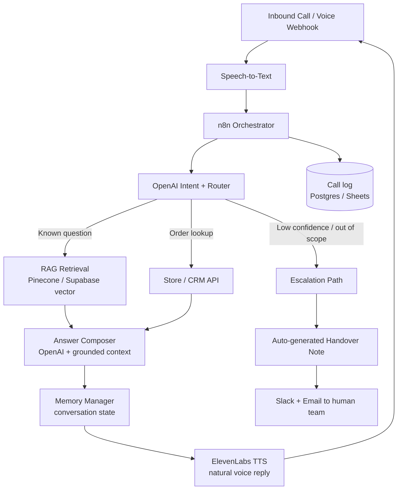

# Case Study — AI Voice Agent for a Homeware E-commerce Brand

> **Client:** Homeware e-commerce brand (London, UK)
> **Role:** AI Automation Strategist / Builder — scoping, architecture, build, deployment
> **Stack:** n8n · OpenAI · ElevenLabs · Pinecone · Supabase · Slack
> **Headline result:** ~75% of inbound calls handled end-to-end with no human, with clean handover notes for the rest.

---

## 1. Context

After a Q4 marketing push, inbound call and enquiry volume spiked. A small support team was
drowning in repetitive questions — order status, returns policy, product availability, delivery
timelines — while the genuinely complex cases waited in the same queue.

The problem wasn't "we need a chatbot." It was: **which calls actually need a human, and how do we
route the rest automatically without the customer feeling handled by a machine.**

## 2. The Strategy Decision (what to automate, and what NOT to)

Before building anything, I split inbound contact into three buckets:

| Bucket | Volume | Decision |
|--------|--------|----------|
| Repetitive, answerable from known data (order status, policy, availability) | High | **Fully automate** |
| Judgement calls (refunds outside policy, complaints, VIP) | Low–medium | **Escalate with context** |
| Ambiguous / emotional | Low | **Escalate fast, no bot loops** |

The strategic point: the goal was **deflection with a graceful exit**, not "automate everything."
Forcing a bot on the second and third buckets is where most voice-agent projects lose trust. So the
system was designed to *know its own limits* and hand off early with a written summary — which turned
out to be the feature the client valued most.

## 3. Architecture

**Flow in words:**

1. Call hits a **voice webhook**; audio is transcribed to text.
2. **n8n** orchestrates everything and holds the routing logic.
3. **OpenAI** classifies intent and confidence.
4. Known questions are answered via **RAG** — responses are grounded in the brand's own policy docs
   and product data (vector store re-indexed nightly), so the agent doesn't hallucinate policy.
5. Live order questions hit the **store/CRM API** directly.
6. A **memory manager** keeps conversation context so it doesn't repeat itself.
7. **ElevenLabs** turns the reply into natural speech.
8. On low confidence or out-of-scope, the agent **stops trying**, generates a **handover note**
   (who called, what they wanted, what was already said), and pushes it to the human team via
   Slack + email.
9. Every call is **logged** for review and tuning.

## 4. Reliability & guardrails

Automation that touches customers has to fail safely. Built in:

- **Confidence threshold** → below it, escalate instead of guessing.
- **RAG grounding** → answers cite the brand's real policy/product data; no invented refund rules.
- **Human handover notes** → every escalation arrives with full context, so nothing restarts from zero.
- **Nightly re-indexing** → policy/product changes reflected next day, no stale answers.
- **Full call logging** → weekly review loop to catch weak spots and expand coverage.

## 5. Results

| Metric | Before | After |
|--------|--------|-------|
| Inbound calls handled without a human | 0% | **~75%** |
| Handover quality | Verbal / lost context | **Written notes, better than manual** |
| Team focus | Buried in repetitive Qs | Freed for complex cases |
| Availability | Business hours | **24/7** |

> *"We were drowning in unanswered enquiries after our Q4 push. Redowan's AI voice agent now handles
> three quarters of inbound calls end to end, and the handover notes it leaves for my team are honestly
> better than what we wrote ourselves."*
> — **Oliver Bennett**, E-commerce Director (Homeware Brand, London, UK)

## 6. What I'd carry into the next build

- Lead with **routing strategy**, not model choice. The value was in *what to escalate*.
- The **handover note** was the sleeper feature — humans trust automation more when it hands off well.
- **Grounding beats cleverness.** RAG on real policy docs prevented the failure mode that sinks
  customer-facing bots: confidently wrong answers.

---

*Reference architecture for this build lives in the workflow portfolio as a credential-free
reference build: [AI Voice Chatbot (ElevenLabs)](https://github.com/Redsf/n8n-workflows/tree/main/voice_chatbot_elevenlabs_restaurants).*
