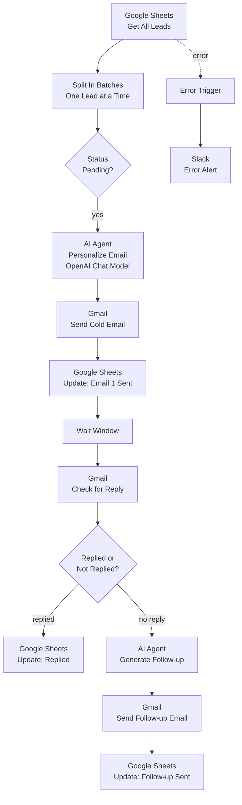

# Case Study — Cold Email Outreach Engine for a B2B SaaS Platform

> **Client:** B2B SaaS platform (Austin, US)
> **Role:** AI Automation Strategist / Builder
> **Stack:** n8n · OpenAI · Gmail · Google Sheets · Slack
> **Headline result:** 10–12 qualified meetings/month booked, ~87% of manual outreach work removed from the SDR's week.

---

## 1. Context

The client had already burned budget on three outbound agencies. Each one promised "outbound magic"
and delivered generic blasts that read like templates — low reply rates, occasional spam complaints,
zero qualification before a meeting got booked.

The real problem wasn't *volume* of outreach. It was that **every message looked the same to the
recipient**, and the SDR was spending most of their week on the mechanical parts of the job — writing
first-touch emails, manually checking for replies, chasing non-responders — instead of the parts that
actually need a human: judgment calls on hot leads.

## 2. The Strategy Decision

Before writing a single email template, the process got split the same way every automation project
should start:

| Step | Manual today | Decision |
|------|-------------|----------|
| Writing personalized first-touch email per lead | Yes — biggest time sink | **Automate**, but personalize per-lead, not templated |
| Detecting a reply and updating CRM state | Yes — manual inbox checking | **Automate** fully |
| Writing a follow-up when no reply | Yes | **Automate**, softer angle than first touch |
| Deciding whether a reply is a real lead vs. an auto-reply/OOO | Sometimes missed | **Keep human-reviewed** for reply *content*, automate only the *detection* |

The strategic call: automate the entire mechanical loop (write → send → wait → check → follow up →
log), but never auto-send a reply to an actual prospect response — that's where a human closes.

## 3. Architecture

**Flow in words:**

1. Leads are pulled from a **Sheet** one at a time, so the sheet is always the single source of truth
   for outreach state — no lead gets touched twice.
2. An **AI agent** writes the first-touch email per lead, using the lead's own context (role, company,
   signal) instead of a shared template — this is what actually moved the reply rate.
3. **Gmail** sends it, and the sheet is updated immediately so a crash mid-run can't double-send.
4. After a wait window, the workflow **checks for a reply** directly in Gmail.
5. No reply → a second AI agent drafts a **softer follow-up** automatically, different angle from the
   first touch, not just "just bumping this."
6. Every state change (sent, replied, followed-up) is logged back to the sheet, so pipeline reporting
   is always current without anyone touching a spreadsheet by hand.
7. **Slack alerts** fire on any node failure — a stalled Gmail auth or Sheets rate-limit doesn't
   fail silently for a week before someone notices leads stopped moving.

## 4. Reliability & guardrails

- **Sheet as source of truth** → prevents duplicate sends if the workflow re-runs.
- **Personalization by AI agent, not templating** → the actual lever behind reply-rate improvement.
- **No auto-send on detected replies** → real prospect responses always route to a human, never
  auto-answered.
- **Error alerting to Slack** → the team finds out about a broken run in minutes, not at month-end
  when someone asks why pipeline is dry.

## 5. Results

| Metric | Before | After |
|--------|--------|-------|
| SDR time on mechanical outreach | Full-time task | **~87% removed** |
| Qualified meetings booked | Inconsistent, agency-dependent | **10–12/month**, steady |
| Reply detection | Manual inbox checking | Automatic, logged |
| Follow-up cadence | Often skipped | 100% coverage |

> *"I've hired three agencies that promised outbound magic and delivered spam. Redowan's cold email
> engine books us 10 to 12 qualified meetings a month with reply detection and CRM sync baked in. My
> SDR got a full workday back every week."*
> — **Rachel Donovan**, VP Sales — B2B SaaS Platform, Austin, US

## 6. What I'd carry into the next build

- **Personalization is the lever, not volume.** More emails without personalization is exactly what
  the failed agencies already tried.
- **State lives in one place.** A single sheet as source of truth avoided the classic failure mode of
  outreach tools losing track of who's already been contacted.
- **Automate the loop, not the judgment call.** Detecting a reply is mechanical; deciding how to
  respond to a real prospect is not — keep that with the human.

---

*Reference architecture for this build is the credential-free reference version in the workflow
portfolio: [Cold Email Outreach Automation](https://github.com/Redsf/N8N-workflows/tree/main/cold_email_outreach_automation).*
