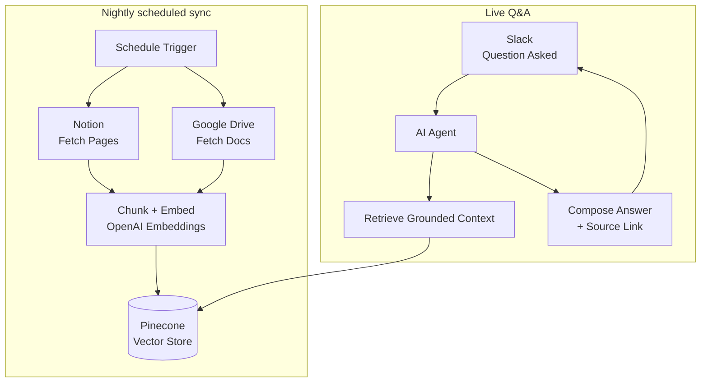

# Case Study — Internal Knowledge Chatbot for a Fintech Company

> **Client:** Fintech company (Lyon, FR)
> **Role:** AI Automation Strategist / Builder
> **Stack:** n8n · OpenAI · Pinecone · Notion · Google Drive · Slack
> **Headline result:** New-hire onboarding time cut by 50%, delivered in three weeks, exactly as scoped.

---

## 1. Context

A fast-growing fintech company had its policy, product, and process knowledge scattered across
Notion pages and Google Drive folders. New hires spent their first weeks pinging People & Ops in
Slack with the same questions — "what's the expense policy," "how do I request time off," "which
tool do I use for X" — because nobody could realistically keep a wiki page open for every question
a new hire might have.

The People & Ops lead didn't want a generic FAQ bot. In a regulated fintech environment, a bot that
**confidently gives a wrong answer about a compliance-adjacent policy** is worse than no bot at all.

## 2. The Strategy Decision

The non-negotiable requirement, set before any build work started: **every answer must be traceable
to a real source document.** That single constraint shaped the entire architecture — this couldn't
be a fine-tuned model reciting policy from memory; it had to be retrieval-grounded, every time,
with the source visible.

| Requirement | Why it mattered | Design response |
|---|---|---|
| Answers must cite sources | Fintech compliance — no confident hallucination | RAG only, no answer without a matching retrieved chunk |
| Docs change often | Policy pages get edited monthly | **Nightly re-index**, not a one-time ingestion |
| Must live where people already ask questions | Slack is where new hires already ask | Slack-triggered agent, not a separate portal to remember |

## 3. Architecture

**Flow in words:**

1. A **nightly schedule** pulls the latest Notion pages and Drive documents — so a policy edited
   yesterday is reflected in tonight's answers, not next quarter's.
2. Documents are **chunked and embedded**, then written into **Pinecone**.
3. When a new hire asks a question in **Slack**, an AI agent retrieves the most relevant grounded
   chunks from the vector store.
4. The agent composes an answer **and attaches the source link** it pulled from — so the new hire
   (or the People & Ops lead auditing the bot) can verify it, not just trust it.
5. If retrieval comes back empty or low-confidence, the agent says so rather than guessing — the
   same escalate-don't-hallucinate principle used across every RAG build in this portfolio.

## 4. Reliability & guardrails

- **Source-cited answers only** → no answer ships without a retrieved chunk backing it; removes the
  single biggest risk in a policy-answering bot.
- **Nightly re-indexing** → stale answers were the #1 failure mode being designed against; this
  closes that gap without anyone manually re-uploading docs.
- **Lives inside Slack** → zero new tool for new hires to learn, adoption was immediate.
- **Delivered to scope, on time** → three weeks, as quoted, no slip — reliability isn't just about
  the running system, it's about the client trusting the delivery process too.

## 5. Results

| Metric | Before | After |
|--------|--------|-------|
| New-hire onboarding time | Baseline | **−50%** |
| Repeated Slack questions to People & Ops | High, daily | Deflected to bot |
| Answer traceability | N/A (human memory) | **Every answer source-linked** |
| Docs freshness | Manual, inconsistent | **Re-indexed nightly** |

> *"Our internal chatbot answers policy and product questions with source links attached and
> re-indexes our docs nightly. New-hire onboarding time dropped by half. Delivered in three weeks,
> exactly as scoped, not a day late."*
> — **Élodie Rousseau**, People & Ops Lead — Fintech Company, Lyon, FR

## 6. What I'd carry into the next build

- **In a regulated or trust-sensitive domain, the constraint comes before the architecture.**
  "Must cite sources" wasn't a nice-to-have — it was the design brief in one sentence.
- **Meet users where they already are.** Slack-native beat "yet another portal" for adoption, every
  time, in every internal tool build I've shipped.
- **Freshness is a reliability feature, not a bonus.** A RAG bot answering from six-month-old policy
  docs is a liability, not a convenience.

---

*Reference architecture for this build is the credential-free reference version in the workflow
portfolio: [RAG-Powered Internal Knowledge Chatbot](https://github.com/Redsf/n8n-workflows/tree/main/rag_internal_knowledge_chatbot).*
