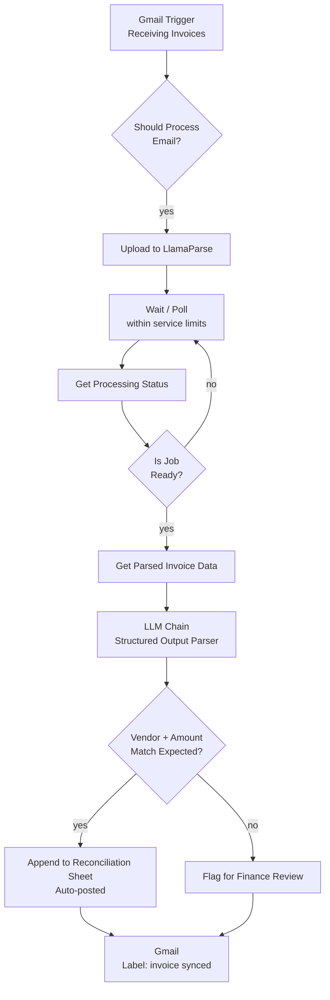

# Case Study — Invoice Processing Automation for a Logistics Firm

> **Client:** Logistics firm (Manchester, UK)
> **Role:** AI Automation Strategist / Builder
> **Stack:** n8n · Gmail · LlamaParse · OpenAI (structured output) · Google Sheets/Xero
> **Headline result:** Month-end close from three days of manual entry to near zero, with automatic vendor-mismatch flagging.

---

## 1. Context

The finance team's month-end close was dominated by one task: manually keying in vendor invoices
that arrived by email. Three days of the month, every month, went into opening PDFs, reading line
items, and typing them into the accounting system by hand — tedious, error-prone, and it delayed
every other close task behind it.

The operations director's real fear wasn't just the time cost. It was **silent errors** — a mistyped
amount or a mismatched vendor that goes unnoticed until an audit or a reconciliation gap months later.

## 2. The Strategy Decision

This is a case where "automate the extraction" is the obvious 80% — the strategic value was in the
other 20%: **deciding what happens when the data doesn't look right.**

| Scenario | Naive approach | Decision made |
|---|---|---|
| Invoice data extracts cleanly, vendor matches known list | Auto-post | **Auto-post**, no human touch |
| Invoice data extracts, but vendor is unrecognized or amount looks anomalous | Auto-post anyway (common failure mode) | **Flag for human review** — never silently post |
| Email isn't actually an invoice (newsletter, receipt, spam) | Process everything that hits inbox | **Filter first** — don't waste extraction calls or risk garbage data downstream |

The point of the build wasn't "remove humans from invoice processing." It was **remove humans from
the 90% that's unambiguous, and route the 10% that needs judgment straight to the people who have it**
— which is exactly why "nothing dodgy slips through" was the detail the client called out, not just
the speed.

## 3. Architecture

**Flow in words:**

1. **Gmail** watches the invoices inbox; a filter step decides whether an incoming email is actually
   an invoice before spending any processing on it.
2. The PDF goes to **LlamaParse** for structured extraction, with the workflow polling until the job
   completes rather than assuming a fixed processing time.
3. Extracted data is run through an **LLM chain with a structured output parser** — the output is
   guaranteed-shape JSON (vendor, amount, line items), not free text that finance then has to
   re-interpret.
4. Data that **matches the known vendor list and expected range auto-posts** to the reconciliation
   sheet / accounting system.
5. Anything that **doesn't match** — new vendor, unusual amount, malformed line item — gets **flagged
   for a human** instead of silently posting. This is the guardrail the client specifically valued.
6. The source email gets labeled so nothing gets double-processed on the next inbox poll.

## 4. Reliability & guardrails

- **Filter before extraction** → don't burn processing (or risk bad data) on non-invoice email.
- **Structured output parsing** → extraction results are typed and validated, not free-text guesses.
- **Vendor/amount mismatch → human flag, never silent auto-post** → the single guardrail that
  converts "fast" into "trustworthy" for a finance team.
- **Polling with backoff** → respects LlamaParse's service limits instead of hammering the API.
- **Label-based dedup** → prevents the same invoice being processed twice on the next scheduled check.

## 5. Results

| Metric | Before | After |
|--------|--------|-------|
| Month-end invoice entry | 3 days of manual keying | **Near zero** |
| Mismatched/anomalous invoices | Caught only on audit, if at all | **Flagged automatically, same day** |
| Duplicate processing risk | Manual tracking | **Eliminated via labeling** |

> *"The invoice pipeline he built, Gmail to extraction to Xero, took our month-end close from three
> days of manual entry to basically zero. Anything that doesn't match the vendor list gets flagged
> for my team, so nothing dodgy slips through."*
> — **Daniel Whitmore**, Operations Director — Logistics Firm, Manchester, UK

## 6. What I'd carry into the next build

- **The guardrail is the deliverable, not the extraction.** Anyone can wire a PDF parser to an LLM;
  the client-valued feature was the mismatch flag that made it safe to trust.
- **Filter early.** Deciding what *not* to process is as important as the extraction pipeline itself.
- **Structured output over free text, every time data feeds an accounting system.** Free-text LLM
  output into a ledger is a reconciliation nightmare waiting to happen.

---

*Reference architecture for this build is the credential-free reference version in the workflow
portfolio: [Invoice Extraction with LlamaParse](https://github.com/Redsf/n8n-workflows/tree/main/invoice_extraction_llamaparse)
(vendor-matching and human-review routing shown here are the production-layer additions built on
top of that reference pipeline for this client).*
